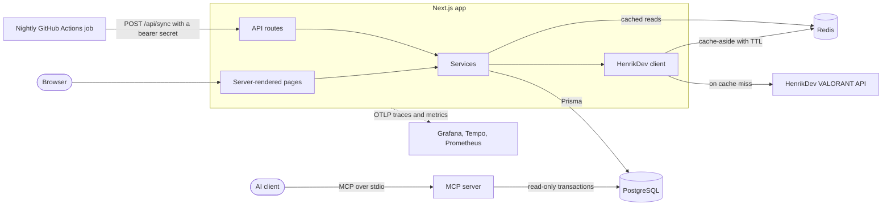
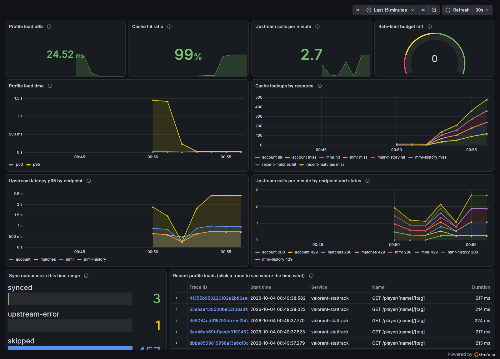
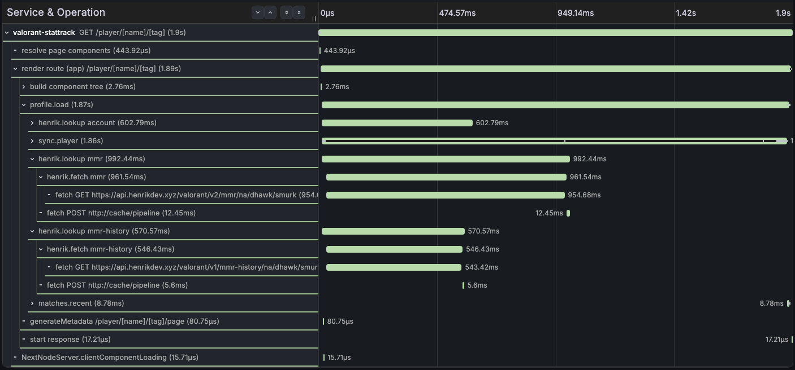

# VALORANT StatTrack

[](https://github.com/andrewwsou/valorant-tracker/actions/workflows/ci.yml)

Look up any VALORANT player to see their rank, recent competitive matches, and performance stats, and compare tracked players on a leaderboard. Match history is stored in PostgreSQL, third-party API lookups are cached in Redis, and a nightly GitHub Actions job keeps tracked players up to date. AI assistants can query the same stats through a read-only MCP server.


## Highlights

- **Fast, readable UI.** A dark, responsive interface: a search box that accepts a pasted Riot ID, stat tiles with color and meters, a recent-form strip with the current streak, win and loss markers on every match, and a sortable leaderboard. A loading skeleton appears at once while a first-time profile syncs.
- **One resilient API client.** Every call to the third-party VALORANT API goes through `src/lib/henrik.ts`. It caches results and failures, so repeat views make zero upstream calls under the API's limit of 30 requests per minute. Each call has timeouts, a deadline, and at most one jittered retry. A 429 or an empty budget starts a cooldown shared through Redis, and a circuit breaker opens after 5 failures in a row.
- **Validated upstream data.** Every payload the app stores or renders is checked with zod. IDs are strict; any other bad field becomes null and is counted in a metric, so one odd value never discards a match.
- **Players are their PUUID.** A player is identified by Riot's permanent ID, and Riot IDs match in any capitalization, so renames never split a player. Simultaneous views of one player share a Redis lock and make one upstream call between them.
- **Idempotent, deadlock-free ingestion.** A sync upserts matches and stat lines in two batched statements, sorted by key so teammates syncing the same matches can't deadlock. Re-running a sync never creates duplicates.
- **Precomputed player stats.** Each sync rebuilds the player's `PlayerStats` row in one short, locked transaction. The leaderboard reads that one indexed table instead of every match row.
- **MCP server for AI agents.** Three typed tools expose player stats, recent matches, and the leaderboard over stdio. Postgres enforces read-only access, every call is capped, and the server never calls an AI model itself.
- **Observability.** OpenTelemetry traces every request through the cache, the upstream API, and each query. Custom metrics feed a preloaded Grafana dashboard.
- **Tested at three levels, in CI.** 251 unit tests, 61 browser tests against the production build, and a k6 load test that fails the build if either page's p95 passes 250 ms. CI also lints, type-checks, audits dependencies, and boots the full Docker stack.
- **Production Docker image.** A multi-stage build: 382 MB, non-root, with no source code or secrets inside.

## Architecture



What happens when someone opens a profile:

1. The profile service syncs the player's latest competitive matches into Postgres, unless they synced in the last 5 minutes.
2. At the same time, rank, rank history, and the player card load from the HenrikDev API through the Redis cache.
3. The sync rebuilds the player's `PlayerStats` row, and the 10 newest matches are read from Postgres.
4. K/D, ACS, ADR, win rate, and the tracker score are computed by pure functions in `src/services/stats.ts`.
5. If any part fails, the page still renders and says what failed.

| Data | Cached for |
|---|---|
| Player card and account | 1 hour |
| Rank and rank history | 5 minutes |
| Recent matches from Postgres | 60 seconds, cleared when a sync writes new matches |
| Player not found, or no matches yet | 5 minutes |
| API errors and timeouts | 30 seconds |

When the upstream API misbehaves, each part of the page fails on its own:

| Situation | What the app does |
|---|---|
| Hangs or stalls | Each attempt times out (3 s, or 10 s for match data), inside an overall deadline |
| 5xx or connection refused | One retry after a random wait, only while rate-limit budget is left |
| 429, or budget at 0 | No retry. Every instance pauses for as long as the API asked, and the page says so |
| 5 failures in a row | A circuit breaker pauses calls for 30 s, then lets one probe through |

## Observability

Traces and metrics go out over OTLP, so any compatible backend works. Locally, one command adds Grafana, Tempo, and Prometheus, with the dashboard preloaded at http://localhost:3001:

```bash
docker compose -f docker-compose.yml -f docker-compose.observability.yml up --build
```



A trace of a first-time profile view. The card and rank lookups run while the match sync is still going:



The 13 custom metrics (all named `stattrack.*`) cover profile load time, cache hits and misses, upstream latency, failures, retries and cooldowns, the rate-limit budget, payload validation, and sync outcomes. Telemetry stays off unless `OTEL_EXPORTER_OTLP_ENDPOINT` is set.

## AI agent access (MCP)

`src/mcp/` is a [Model Context Protocol](https://modelcontextprotocol.io) server, so an AI assistant can answer questions like "who has the best K/D, and how did their last three matches go?" from this app's data.

| Tool | Input | Returns |
|---|---|---|
| `get_leaderboard` | `sort`, `minMatches`, `limit` | Ranked players with record, tracker score, ACS, K/D, and win rate |
| `get_player_stats` | `riotId`, such as `TenZ#NA1` | One player's stats over their last 10 stored matches |
| `get_recent_matches` | `riotId`, `limit` | Newest matches with map, result, score, K/D/A, ACS, and ADR |

Add it to an MCP client with a command like this one for Claude Code, or the equivalent JSON config:

```bash
claude mcp add stattrack --env DATABASE_URL="postgresql://..." -- npm --prefix "$PWD" run --silent mcp
```

**Cost safeguards.** The server can't spend AI tokens by itself:

- It never calls a model and doesn't use MCP sampling. A CI test keeps it that way.
- It only runs while a client has it open, and exits on disconnect or after 10 idle minutes.
- At most 30 calls a minute and 300 per session, results capped at 16 KB, and 5 seconds of database time per call.
- Every call runs in a `READ ONLY` transaction, and it never calls the HenrikDev API.

The `MCP_*` environment variables can lower these limits but never raise them.

## Getting started

You need Node 22 or newer, Docker, and a [HenrikDev](https://docs.henrikdev.xyz) API key.

```bash
cp .env.example .env    # then set HENRIKDEV_API_KEY
docker compose up --build
```

Open http://localhost:3000. Compose starts Postgres, Redis, a migration job, and the app.

To develop with hot reload instead:

```bash
npm install
docker compose up -d db cache migrate
npm run dev
```

| Command | What it does |
|---|---|
| `npm run dev` / `npm run build` | Development server, production build |
| `npm run lint` / `npm run typecheck` | ESLint, TypeScript |
| `npm test` | Unit tests (Vitest) |
| `npm run test:e2e` | Browser tests (Playwright). Needs `docker compose up -d db cache` and a build |
| `npm run test:load` | k6 load test against `npm run e2e:serve` |
| `npm run mcp` | The MCP server over stdio. Needs an explicit `DATABASE_URL` |

## Testing

| Level | Tool | What it covers |
|---|---|---|
| Unit | Vitest | Stat math, sync, caching, payload validation, the API client's timeouts, retries, cooldowns and circuit breaker, and the MCP tools and their limits |
| End to end | Playwright | Search, profile numbers, the leaderboard, and phone layout in a real browser. Also concurrent syncs and row locks on a real database, the MCP server over real stdio, and a misbehaving API: 429s, 503s, hangs, and unreadable data |
| Load | k6 | 20 requests per second to each page for 30 seconds. Fails above a 250 ms p95 or 1% errors |

The browser and load tests run against a mock of the HenrikDev API, so they are deterministic and never spend the real rate limit.

## Configuration

| Variable | Required | Description |
|---|---|---|
| `DATABASE_URL` | yes | PostgreSQL connection string |
| `UPSTASH_REDIS_REST_URL`, `UPSTASH_REDIS_REST_TOKEN` | yes | Redis REST endpoint and token: Upstash, or the local proxy |
| `HENRIKDEV_API_KEY` | yes | HenrikDev API key |
| `CRON_SECRET` | for the nightly sync | Bearer secret that `POST /api/sync` requires. At least 32 characters: `openssl rand -hex 32` |
| `OTEL_EXPORTER_OTLP_ENDPOINT` | no | Where to send traces and metrics |

The nightly workflow reads three GitHub Actions secrets: `BASE_URL` (the deployed app), `CRON_SECRET` (the same value as the app's), and `SYNC_PLAYERS`, a JSON array such as `[{"puuid":"54942ced-..."}]`. The run fails loudly, with a per-player summary, when any player fails.

## API

| Method | Endpoint | Returns |
|---|---|---|
| `GET` | `/api/player?name=&tag=` | Account details and player card |
| `GET` | `/api/overall?region=&name=&tag=` | Current and peak rank |
| `GET` | `/api/elo?region=&name=&tag=` | Rank change for each recent match |
| `GET` | `/api/db/matches?name=&tag=&limit=` | Recent matches from Postgres |
| `GET` | `/api/leaderboard?sort=&minMatches=&limit=` | Top players by `trackerScore`, `acs`, `kd`, or `winRate` |
| `POST` | `/api/sync?name=&tag=` or `?puuid=` | Pulls recent matches into Postgres. Needs `Authorization: Bearer <CRON_SECRET>` |
| `GET` | `/api/health` | Database and cache status |

## Project structure

```
src/
  app/          pages (home, player profile, leaderboard) and API routes
  components/   UI components
  services/     profile loading, sync, player stats, leaderboard, stat math
  lib/          HenrikDev client, rate-limit handling, zod schemas, Redis, telemetry
  mcp/          the MCP server: tools, read-only transactions, limits, idle exit
e2e/            Playwright tests and the mock HenrikDev API
load/           k6 load test
prisma/         schema and migrations
scripts/        nightly sync job and the stats backfill
```

## Tech stack

TypeScript, Next.js 15 (App Router), React 19, Tailwind CSS 4, PostgreSQL 16, Prisma 6, Redis (Upstash), OpenTelemetry, Grafana, Docker, GitHub Actions.

---

VALORANT StatTrack is a fan project and isn't endorsed by Riot Games. VALORANT and Riot Games are trademarks of Riot Games, Inc. Player data comes from the unofficial [HenrikDev API](https://docs.henrikdev.xyz).
