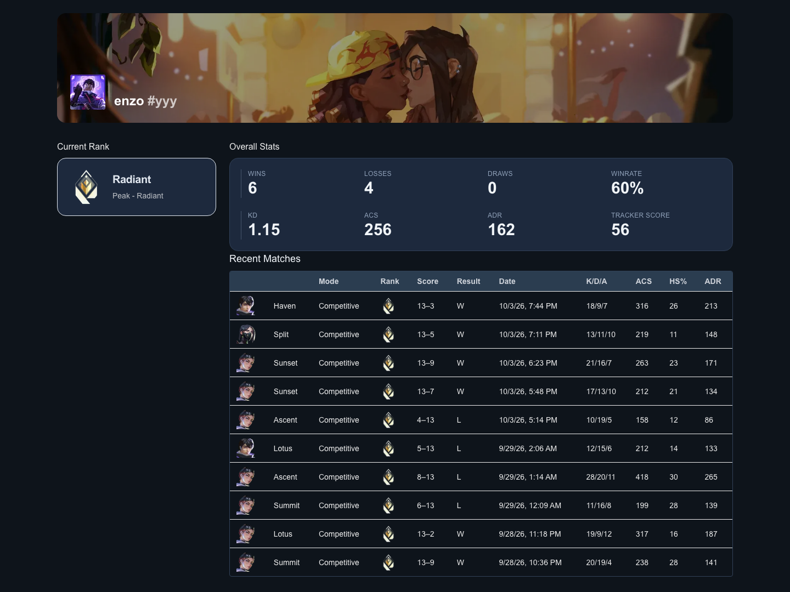
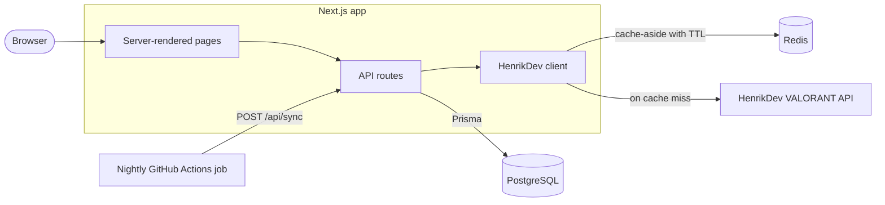

# VALORANT StatTrack

Look up any VALORANT player to see their rank, recent competitive matches, and performance stats. Match history is stored in PostgreSQL, third-party API lookups are cached in Redis, and a nightly GitHub Actions job keeps tracked players up to date.



## Highlights

- **One cached API client.** Every call to the third-party VALORANT API goes through `src/lib/henrik.ts`, which uses cache-aside with a TTL per kind of data. Repeat profile views make zero upstream calls, which matters under the API's 30-requests-per-minute limit.
- **Idempotent ingestion.** Syncing upserts matches by match ID and player stats by a unique (match, player) key, so re-running a sync never creates duplicates. A 5-minute cooldown protects the rate limit.
- **Normalized schema.** `Match`, `Player`, and `PlayerMatch` tables with unique constraints and indexes on every lookup path.
- **Production Docker image.** A multi-stage build with Next.js standalone output: 382 MB, runs as a non-root user, and contains no source code or secrets.
- **Health checks and graceful degradation.** `/api/health` checks Postgres and Redis. If the cache goes down, pages keep working and health reports `degraded`. If the database goes down, health returns 503.
- **Nightly sync** through a scheduled GitHub Actions workflow.

## Architecture



What happens when someone opens a profile:

1. The page asks `/api/sync` to pull the player's latest competitive matches. The sync is skipped if it already ran in the last 5 minutes.
2. Matches and per-player stats are upserted into Postgres.
3. K/D, ACS, ADR, win rate, and the tracker score are computed from the stored rows.
4. Rank, rank history, and the player card come from the HenrikDev API through the Redis cache.

| Data | Cached for | Why |
|---|---|---|
| Player card and account | 1 hour | Changes only when the player edits their profile |
| Rank and rank history | 5 minutes | Changes only after a match, and matches sync at most every 5 minutes |
| Recent matches from Postgres | 60 seconds | Cleared whenever a sync writes new matches |
| Raw match details | not cached | About 7 MB per 10 matches, and the fields we need already live in Postgres |

## Tech stack

TypeScript, Next.js 15 (App Router), React 19, Tailwind CSS 4, PostgreSQL 16, Prisma 6, Redis (Upstash), Docker, GitHub Actions.

## Getting started

You need a [HenrikDev](https://docs.henrikdev.xyz) API key.

### Run everything with Docker

```bash
cp .env.example .env    # then set HENRIKDEV_API_KEY
docker compose up --build
```

Open http://localhost:3000. Compose starts Postgres, Redis, a migration job, and the app, and waits for each one to be healthy before starting the next.

### Develop locally

```bash
npm install
cp .env.example .env    # then set HENRIKDEV_API_KEY
docker compose up -d db cache migrate
npm run dev
```

In production the app reaches Redis through Upstash's REST API. Locally, [serverless-redis-http](https://github.com/hiett/serverless-redis-http) serves the same API in front of a plain Redis, so the app runs the same cache code in both places.

| Command | What it does |
|---|---|
| `npm run dev` | Development server with hot reload |
| `npm run build` | Production build |
| `npm run lint` | ESLint |
| `npm run typecheck` | TypeScript type check |

## Configuration

| Variable | Required | Description |
|---|---|---|
| `DATABASE_URL` | yes | PostgreSQL connection string |
| `UPSTASH_REDIS_REST_URL` | yes | Redis REST endpoint: Upstash, or the local proxy |
| `UPSTASH_REDIS_REST_TOKEN` | yes | Token for that endpoint |
| `HENRIKDEV_API_KEY` | yes | HenrikDev API key |
| `NEXT_PUBLIC_BASE_URL` | no | Base URL the server uses to call its own API routes. Defaults to `http://localhost:3000` |

The nightly workflow reads two GitHub Actions secrets: `BASE_URL`, the deployed app, and `SYNC_PLAYERS`, a JSON array such as `[{"name":"PlayerName","tag":"NA1"}]`.

## API

| Method | Endpoint | Returns |
|---|---|---|
| `GET` | `/api/player?name=&tag=` | Account details and player card |
| `GET` | `/api/overall?region=&name=&tag=` | Current and peak rank |
| `GET` | `/api/elo?region=&name=&tag=` | Rank change for each recent match |
| `POST` | `/api/sync?region=&name=&tag=&size=` | Pulls recent matches into Postgres |
| `GET` | `/api/db/matches?name=&tag=&limit=` | Recent matches from Postgres |
| `GET` | `/api/health` | Database and cache status |

`region` defaults to `na` and must be one of `na`, `eu`, `ap`, `kr`, `latam`, or `br`. Cached endpoints return an `x-cache` header set to `HIT` or `MISS`.

## Project structure

```
src/
  app/
    api/                   route handlers
    player/[name]/[tag]/   player profile page
  components/              UI components
  lib/
    henrik.ts              HenrikDev client: auth, URLs, caching, logging
    redis.ts               cache helpers
    prisma.ts              database client
    riot-id.ts             input parsing and region allowlist
prisma/                    schema and migrations
scripts/nightly-sync.ts    nightly ingestion job
```

## Roadmap

- [ ] Unit and end-to-end tests, with CI on every pull request
- [ ] OpenTelemetry traces and metrics
- [ ] Leaderboard backed by precomputed aggregates
- [ ] MCP server so AI agents can query player stats
- [ ] Retries with backoff and rate-limit handling for upstream calls

---

VALORANT StatTrack is a fan project and isn't endorsed by Riot Games. VALORANT and Riot Games are trademarks of Riot Games, Inc. Player data comes from the unofficial [HenrikDev API](https://docs.henrikdev.xyz).
